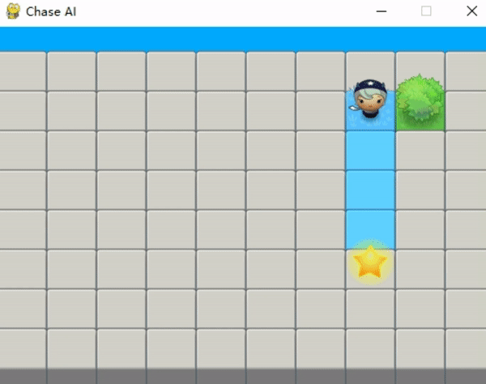
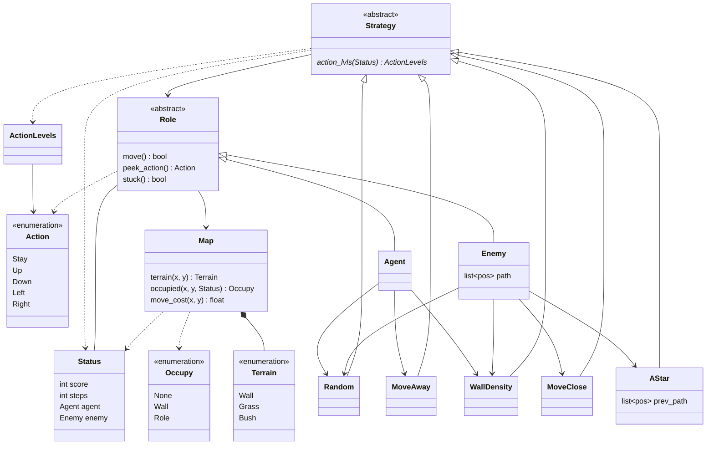

# Chase the Star

[](https://www.python.org)


## Introduction



An artificial intelligence game to demonstrate the ***A\* path-finding***. The enemy will try to get close to the agent and make it stuck between walls.

## Getting Started

### Prerequisites

- Install [*Python 3.11*](https://www.python.org).

- Install all dependencies.

  ```bash
  pip install -r requirements.txt
  ```


## 🌟 Features

### Core Gameplay
- **Dynamic Chase Mechanics**: Enemy must visit checkpoints A & B before capturing the agent
- **Hidden Tunnels**: Bidirectional teleportation system (shows pipe markers after discovery)
- **Varied Terrain**: Grass (fast), bushes (slow/trap), walls (impassable)
- **Fog of War**: Enemy gradually discovers the map while agent has full vision
- **Scoring System**: Based on maintaining safe distance from enemy

### 5 Pathfinding Algorithms

#### 1. **A* (A-Star)** - Default & Optimal
- **Best for**: Balanced performance and optimality
- **How it works**: Uses both actual cost (g) and heuristic estimate (h) to find shortest path
- **Pros**: Optimal, considers terrain costs, efficient
- **Cons**: Can be slow on large maps
- **Use when**: You want guaranteed shortest path with good performance

#### 2. **Dijkstra** - Cost-Focused
- **Best for**: Highly varied terrain costs
- **How it works**: Explores all directions equally based on cumulative cost
- **Pros**: Always finds cheapest path, no heuristic needed
- **Cons**: Slower than A*, explores more nodes
- **Use when**: Terrain costs vary significantly (bushes vs grass)

#### 3. **BFS (Breadth-First Search)** - Step-Minimizing
- **Best for**: When terrain costs don't matter
- **How it works**: Explores layer by layer, finds path with fewest steps
- **Pros**: Very fast, simple, minimal memory
- **Cons**: Ignores terrain costs, may choose expensive paths
- **Use when**: Speed matters more than path quality

#### 4. **Greedy Best-First** - Fast Pursuer
- **Best for**: Aggressive, reactive chasing
- **How it works**: Always moves toward target based on heuristic only
- **Pros**: Extremely fast, very aggressive
- **Cons**: Not optimal, can get trapped easily
- **Use when**: You want fast, reactive enemy behavior

#### 5. **JPS (Jump Point Search)** - Optimized A*
- **Best for**: Open maps with long straight paths
- **How it works**: Skips unnecessary nodes by "jumping" along straight lines
- **Pros**: Much faster than A* on grid maps
- **Cons**: Complex implementation, needs uniform costs
- **Use when**: You have large, open areas

## 🚀 Installation

```bash
# Install dependencies
pip install pygame

# Run the game
python main.py
```

## ⚙️ Configuration

Edit `config.json` to customize gameplay:

### Switch Algorithms

```json
{
  "strategyWeights": {
    "enemy": {
      "aStar": 1,      // Use A* exclusively
      "dijkstra": 0,
      "bfs": 0,
      "greedy": 0,
      "jps": 0
    },
    "agent": {
      "moveAway": 1,
      "wallDensity": 0.3
    }
  }
}
```

### Mix Multiple Algorithms

```json
{
  "enemy": {
    "aStar": 0.7,     // 70% A*
    "dijkstra": 0.2,  // 20% Dijkstra
    "greedy": 0.1     // 10% Greedy
  }
}
```

### Map Settings

```json
{
  "mapSize": {
    "width": {"min": 12, "max": 16},
    "height": {"min": 8, "max": 12}
  },
  "terrainProb": {
    "wall": 0.25,   // 25% chance of walls
    "bush": 0.2     // 20% chance of bushes
  },
  "moveCost": {
    "grass": 1,
    "bush": 10      // Bushes are 10x slower
  }
}
```

## 🎮 Controls

- **SPACE**: Pause/Resume
- **R**: Restart game
- **Q**: Quit

## 🧠 Strategy Comparison

### Performance Benchmarks (Average 12x10 Map)

| Algorithm | Nodes Explored | Optimality | Speed |
|-----------|---------------|------------|-------|
| A*        | ~150          | 100%       | ⭐⭐⭐⭐ |
| Dijkstra  | ~300          | 100%       | ⭐⭐⭐ |
| BFS       | ~200          | Varies     | ⭐⭐⭐⭐⭐ |
| Greedy    | ~80           | 60-80%     | ⭐⭐⭐⭐⭐ |
| JPS       | ~50           | 100%       | ⭐⭐⭐⭐⭐ |

### When to Use Each

**Use A*** when:
- Need optimal paths with good performance
- Terrain costs matter
- General-purpose pathfinding

**Use Dijkstra** when:
- Terrain costs vary dramatically (bushes/grass)
- Need guaranteed lowest cost
- Map has no clear direction to target

**Use BFS** when:
- Simple grid with uniform costs
- Speed is critical
- Want minimum steps (not minimum cost)

**Use Greedy** when:
- Want aggressive, reactive AI
- Performance is top priority
- Suboptimal paths are acceptable

**Use JPS** when:
- Large, open maps
- Many straight-line paths
- Uniform movement costs

## 🎯 Game Rules

1. **Checkpoint System**: Enemy must visit both A and B before capturing agent
2. **Tunnels**: Hidden teleports (show pipe symbol after use)
3. **Bush Traps**: Landing on bush = lose next turn
4. **Scoring**: Good step = distance ≥ 2 from enemy
5. **Win Conditions**:
   - Agent survives 500 steps → Agent wins
   - Enemy catches agent (after A & B) → Enemy wins
   - Agent gets stuck → Enemy wins


## 🔬 Algorithm Deep Dive

### A* Implementation Details

```python
# f(n) = g(n) + h(n)
# g(n) = actual cost from start to n
# h(n) = estimated cost from n to goal

while open_set:
    current = min(open_set, key=lambda s: s.f)
    if current == goal:
        return reconstruct_path(current)
    
    for neighbor in current.neighbors:
        new_g = current.g + cost(current, neighbor)
        if new_g < neighbor.g:
            neighbor.g = new_g
            neighbor.h = heuristic(neighbor, goal)
            neighbor.prev = current
```

### JPS Jump Point Identification

```python
# Forced neighbors indicate jump points
if moving horizontally and wall above:
    diagonal = jump point
if moving diagonally:
    check horizontal and vertical jumps
    if found, current is jump point
```

## 📊 Example Output

```
==================================================
🎮 CHASE THE STAR
==================================================
Enemy Algorithm: ASTAR
Map Size: 14x10
Checkpoints: A at (3, 7), B at (10, 2)
Tunnels: 2 bidirectional pairs
==================================================

✓ Enemy visited checkpoint A at step 45
✓ Enemy visited checkpoint B at step 112

==================================================
⏱️ TIME'S UP - Agent Survived!
==================================================
Agent Score: 78%
Total Steps: 500
Good Steps: 390
==================================================
```

## 🐛 Troubleshooting

**Enemy gets stuck**: Increase `moveClose` or `random` weight
**Agent too easy to catch**: Add `wallDensity` or `moveAway` to agent
**Game too slow**: Use `greedy` or `bfs` instead of `aStar`
**Paths ignore bushes**: Check `moveCost` in config


### Class Diagram



## Dependencies

- [*pygame*](https://www.pygame.org)


## Running the Game

### Option 1: Quick Test (Easiest)

```bash
cd Chase-AI-main
python src/quick_test.py
```

This will:
1. Let us select an algorithm (1-5)
2. Automatically update config.json
3. Run the game

### Option 2: Manual Config Edit

1. Open `src/config.json`
2. Change the enemy algorithm:

```json
"enemy": {
    "dijkstra": 1,    // Set this to 1
    "aStar": 0,       // Set others to 0
    "bfs": 0,
    "greedy": 0,
    "jps": 0
}
```

3. Run: `python src/main.py`

### Option 3: Compare All Algorithms

```bash
python src/comparison_test.py --all --games 10
```

This runs each algorithm 10 times and shows statistics.


### Option 4: Head-to-head comparison

```bash
python src/comparison_test.py --compare aStar dijkstra --games 20
```

### Option 5: Analyze specific algorithm with visualizations

```bash
python src/game_analyzer.py aStar --save
python src/game_analyzer.py dijkstra
python src/game_analyzer.py bfs --save
```

### Option 6: Test single algorithm

```bash
python src/comparison_test.py --single dijkstra --games 5
```

---

**Happy Pathfinding! 🚀**

